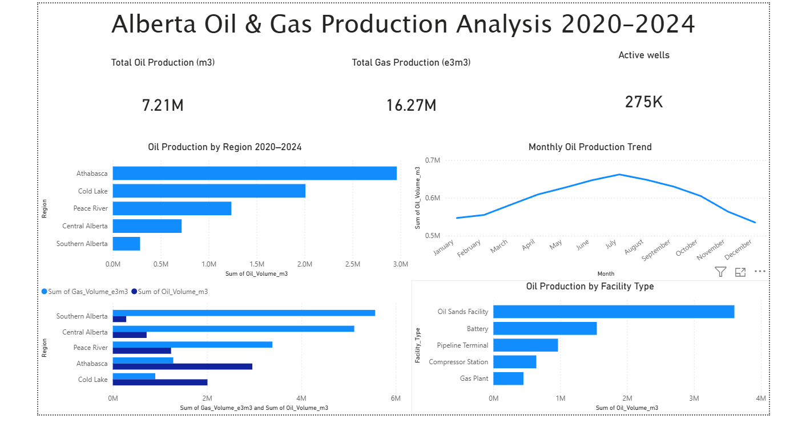

# Alberta Oil & Gas Production Analysis
**Tools:** SQL (SQLite) · Power BI · Python · DB Browser for SQLite

## Project Overview
Analyzed a synthetic Alberta oil and gas production dataset structured to mirror 
Alberta Energy Regulator (AER) conventional volumetrics reporting conventions. 
The dataset covers 5 producing regions, 5 facility types, and 60 months of 
production data from January 2020 to December 2024.

The dataset was purpose-built using Python (see generate_data.py) with documented 
modelling assumptions based on publicly available AER ST98 statistical reports. 
See DATA_GENERATION.md for full methodology.

## Business Questions Explored
- Which Alberta regions produce the most oil and gas?
- How has production declined across regions from 2020 to 2024?
- Which facility types are the most productive?
- What seasonal patterns exist in Alberta production data?
- Which regions have the highest water-to-oil ratios indicating less efficient wells?
- Which operators maintain the highest uptime hours?

## Key Findings
- Athabasca accounts for nearly 50% of total oil production — consistent with 
  its role as Alberta's primary oil sands region
- Southern Alberta shows the steepest production decline at approximately 14% 
  annually — identifying it as the most underperforming producing region
- Oil Sands Facilities produce 2.8x more oil than conventional Batteries — 
  reflecting the thermal SAGD production profile of bitumen operations
- July consistently records peak production while January is the lowest month — 
  confirming a strong seasonal pattern driven by Alberta's operational climate
- Southern Alberta has the highest water-to-oil ratio — indicating mature, 
  less efficient wells requiring more water handling infrastructure

## Business Recommendation
Southern Alberta requires strategic review — its steep decline rate combined 
with high water-to-oil ratios suggests aging conventional wells with deteriorating 
economics. Reallocation of capital toward Athabasca and Cold Lake oil sands 
operations, which show the most stable production profiles, would improve 
overall portfolio performance.

## Dashboard

## Files
| File | Description |
|------|-------------|
| `queries.sql` | All 7 SQL queries used for analysis |
| `generate_data.py` | Python script to regenerate the dataset |
| `DATA_GENERATION.md` | Full methodology and modelling assumptions |
| `alberta_og_production.csv` | The synthetic production dataset |
| `dashboard.png` | Power BI dashboard screenshot |
